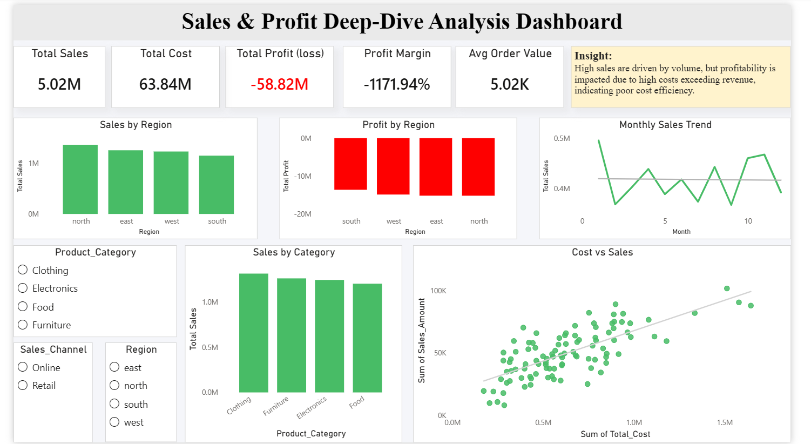

#  Sales & Profit Deep-Dive Analysis Dashboard

##  Project Overview

This project focuses on performing a deep-dive analysis of sales data and building an interactive dashboard to identify key business performance issues.

The objective is to analyze business metrics, identify root causes of poor performance, and present insights through an interactive dashboard.

---

##  Dataset

The dataset includes sales transaction details such as:

* Product Category
* Sales Date
* Region
* Sales Amount
* Quantity Sold
* Unit Cost
* Customer Type
* Payment Method
* Sales Channel

---

##  Key KPIs

* Total Sales
* Total Cost
* Total Profit
* Profit Margin
* Average Order Value

---

##  Deep-Dive Analysis

###  Region Analysis

* North region generates the highest sales
* All regions show negative profit

---

###  Category Analysis

* Clothing and Furniture contribute the most to sales
* Profitability is affected due to high costs

---

###  Monthly Sales Trend

* Sales fluctuate across months
* No consistent upward trend

---

##  Core Insight

The business generates strong sales volume, but high costs exceed revenue, resulting in negative profit across all regions.

---

##  Cost vs Sales Analysis

* Cost increases with sales
* Many transactions have costs higher than sales
* This leads to overall losses

---

##  Recommendations

* Reduce operational and unit costs
* Improve pricing strategy
* Focus on improving profit margins

---

##  Dashboard Features

* KPI cards for business metrics
* Sales by Region analysis
* Profit by Region analysis
* Sales by Category analysis
* Monthly Sales Trend
* Cost vs Sales relationship (scatter plot with trend line)
* Interactive filters:

  * Region
  * Product Category
  * Sales Channel

---
##  Tools Used

* Python (data preparation)
* Power BI (dashboard and visualization)

---

##  Conclusion

The analysis highlights that while the business performs well in terms of sales, poor cost management leads to continuous losses. Strategic cost and pricing improvements are necessary for profitability.

---

##  Dashboard Preview

“This project includes segmentation analysis through region, category, and channel comparisons. Cohort and funnel analysis were not applicable due to the nature of the dataset.”